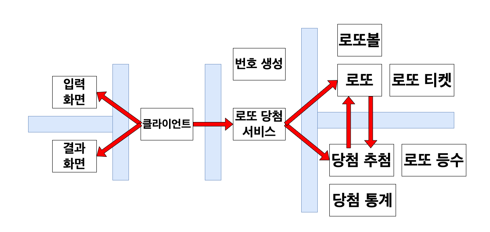

> 목차
> - [개념과 격벽](#개념과-격벽)
> - [기능 요구 사항 분석](#기능-요구-사항-분석)
> - [Lotto 클래스](#Lotto-클래스)
> - [프로그래밍 요구 사항 분석](#프로그래밍-요구-사항-분석)

# 개념과 격벽

|   핵심 개념   |
|:---------:|
|  **로또**   |
| **당첨 추첨** |

- 로또: 1급 개념
  - 로또볼들: 상태
    - 로또볼: 로또 번호를 표현하는 값 객체
- 로또 티켓들: 사용자가 구매한 1개 이상의 로또, 2급 개념
- 당첨 추첨: 1급 개념, 당첨은 **돈 계산 관련 도메인**이다. 즉, 성능/효율보다 **안전성**을 최우선시 해야 한다
  - 당첨 번호: 상태
  - 보너스 번호: 상태
  - 당첨 로또와 비교: 행위
    - 당첨 로또와 비교해 등수를 반환해준다
- 당첨 통계: 2급 개념, 로또 등수별 당첨 개수를 저장
  - 투자 수익 계산: 행위
    - 투자 수익은 수익률이 아님
    - 순환 소수 문제 회피
- 로또 등수: 2급 개념
  - 일치 개수: 고유한 상태
  - 보너스 번호 존재 여부: 고유한 상태
  - 당첨금: 고유한 상태
  - 조회: 행위, 일치하는 등수를 찾아준다
  - 총 당첨금 계산: 등수 별 당첨 개수에 따라 총 당청금을 계산해준다
- 로또 서비스: 로또 서비스의 비즈니스 흐름을 표현, 2급 개념
  - 로또 발권과 당첨 추첨의 비즈니스 흐름을 관리한다
- 번호 생성: 2급 개념, 로또가 알고 있으면 안되는 개념, 발행한 숫자들만 넘겨준다(외부로 분리)
  - 자동 생성: 6개의 번호를 자동으로 생성, 로또 번호의 완벽한 제어/통제 불가능
  - 수동 생성: 6개의 번호를 수동으로 생성, 완벽한 제어/통제 가능
- 클라이언트: 전체 개념들을 이어주는 중간 다리, 3급 개념
  - 값을 다시 입력 받는 책임을 갖고 있음. 즉 예외 처리의 책임이 존재
  - 입력 화면에서 들어온 입력 값으로 서비스에게 요청
  - 서비스의 응답 값으로 결과 화면에게 출력 요청
- 입력 화면: 로또 서비스 사용에 필요한 값을 입력받는 화면, 3급 개념
- 결과 화면: 로또 서비스 결과를 출력하는 화면, 3급 개념
  - 투자 수익을 소수점 둘째 자리에서 반올림해 출력할 책임을 갖음



# Lotto 클래스
- 제공된 `Lotto` 클래스를 사용하여 구현해야 한다.
  - 핵심 개념을 제공
- `Lotto`에 numbers 이외의 필드(인스턴스 변수)를 추가할 수 없다.
  - 일급 컬렉션
  - 왜 일급 컬렉션을 사용할까? 지금까지 이점이 정확히 무엇인지 알고 사용했나? 일급 컬렉션을 설명 할 수 있나?
  - `numbers` 랜덤한 숫자들은 외부에게 첵임을 넘긴다
- `numbers`의 접근 제어자인 `private`은 변경할 수 없다.
  - 상태를 외부에 숨긴다
  - 제공된 기본 형태는 불변, 불변의 장점은?
  - 제네릭 타입을 바꿀 수 있다. 즉, 값 객체로 변경을 제한하지 않음
    - 컴파일 타임 제네릭 타입 소거(실체화 타입(Reifiable Type) vs 비실체화 타입(Non-Reifiable Type))
  - numbers List 타입을 바꿀 수 있다. 즉, Set 사용이 가능
  - numbers 변수 이름도 바꿀 수 있다. 즉, 명확한 의도가 드러나는 네이밍이 있다면 변경 가능
- `Lotto`의 패키지를 변경할 수 있다.
  - 도메인 계층에서 관리할 수 있다
```java
public class Lotto {
    private final List<Integer> numbers;

    public Lotto(List<Integer> numbers) {
        validate(numbers);
        this.numbers = numbers;
    }

    private void validate(List<Integer> numbers) {
        if (numbers.size() != 6) {
            throw new IllegalArgumentException("[ERROR] 로또 번호는 6개여야 합니다.");
        }
    }

    // TODO: 추가 기능 구현
}
```

# 기능 요구 사항 분석

- 간단한 로또 발매기를 구현한다.
  - 로또: 핵심 개념
    - 어떤 방법으로 로또를 발행할 수 있나(자동, 수동)
    - 더 늘어날 발행 방법이 있나? 반자동(자동 개수와 수동 개수를 설정해 발행) -> 아직 고려할 사항은 아님
    - 로또가 발행되지 않은 상황은 무엇인가?
- 로또 번호의 숫자 범위는 1~45까지이다.
  - 1~45 사이의 정수, 중복되지 않아야 한다 -> 도메인 규칙
- 1개의 로또를 발행할 때 중복되지 않는 6개의 숫자를 뽑는다.
  - 중복 X -> 도메인 규칙
- 당첨 번호 추첨 시 중복되지 않는 숫자 6개와 보너스 번호 1개를 뽑는다.
  - 중복 X, 보너스 번호도 당첨 번호와 중복되면 안된다 -> 도메인 규칙
  - 사용자 로또 발행과 분리되어야 한다 -> 당첨 번호 추첨 때 문제가 발생했다면 당첨 번호만 다시 입력 받음, 이미 발행된 로또에는 문제가 없음
  - 즉, 금액 입력, 당첨 번호 입력, 보너스 번호 입력은 별도로 분리해서 관리해야 하고, 클라이언트의 입력 요청들도 분리해 관리
  - 그런데 에러 코드나 에러 상태를 사용하면 입력을 한번에 관리하면서 문제가 발생하는 부분만 입력 받을 수 있지 않을까? 한 번 고민 
- 당첨은 1등부터 5등까지 있다. 당첨 기준과 금액은 아래와 같다.
  - 1등: 6개 번호 일치 / 2,000,000,000원
  - 2등: 5개 번호 + 보너스 번호 일치 / 30,000,000원
  - 3등: 5개 번호 일치 / 1,500,000원
  - 4등: 4개 번호 일치 / 50,000원
  - 5등: 3개 번호 일치 / 5,000원
  - 금액 처리는 어떻게? 정확한 계산, 모두 정수형이기에 부동소수점 문제에 관한 걱정이 필요 없음
- 로또 구입 금액을 입력하면 구입 금액에 해당하는 만큼 로또를 발행해야 한다.
  - 사용자 로또는 자동 발행으로 명시됨
- 로또 1장의 가격은 1,000원이다.
  - 몇 장 까지 구매가 가능할까? 일단 프로그램 실행 시 1회성 구매 -> 1개 발행 매장에서 구매한 것과 비슷 
    - 현실의 로또: 1인 1개 로또 발행 매장에서 100,000원(100장)
    - 토스, 삼쩜삼 같은 서비스 기업에서 이벤트로 진행하는 로또: 기간(하루, 1주) 발행량은 제한이 없으나, 현금이 들지 않아 얻기 힘듬
  - 100장 제한
    - 구매 가능한 로또의 개수가 많으면 도박과 같음 -> 사용자의 재정적 피해 방지와 건전한 여가 활동 고려
    - 공정성 -> 제한이 없다면 사용자의 자산에 따라 구매 가능한 개수가 천차만별, 로또는 모든 참여자에게 비교적 균등한 기회를 제공
    - 시스템 한계 -> 만약 21억 까지 구매가 가능하다면? 210만장 로또는 약 1260만 개의 번호가 생성됨, 출력시 문제
      - Integer 6개는 약 120bytes, List 구조체는 약 68bytes, 따라서 로또 1장 당 약 188bytes -> 210만장은 약 40MB 정도의 메모리를 잡아먹음
      - 100장 제한하면 약 19KB
    - 법적 근거: 만약 실제로 로또 서비스를 출시한다면, 복권기금법 시행규칙을 따라야함, 여기서는 1,000원 이라는 화폐 단위를 사용(포인트가 아님)
- 당첨 번호와 보너스 번호를 입력받는다.
  - 1 ~ 45 사이의 정수, 중복되지 않아야 한다 -> 도메인 규칙
- 사용자가 구매한 로또 번호와 당첨 번호를 비교하여 당첨 내역 및 수익률을 출력하고 로또 게임을 종료한다.
  - 수익률은 부동소수점 -> 부동소수점 문제를 피해야 함
- 사용자가 잘못된 값을 입력할 경우 `IllegalArgumentException을` 발생시키고, `[ERROR]`로 시작하는 에러 메시지를 출력 후 그 부분부터 입력을 다시 받는다.
  - `Exception`이 아닌 `IllegalArgumentException`, `IllegalStateException` 등과 같은 명확한 유형을 처리한다.
    - `IllegalArgumentException`: 사용자가 잘못된 값을 입력할 경우 발생
    - `IllegalStateException`: 현재 객체가 해당 메서드를 실행할 수 있는 상태가 아닌 경우 발생, 즉 잘못된 협력 요청 시 발생
  - 에러 메시지 출력 후 그 부분부터 입력을 다시 받는다 -> 사용자의 어떤 입력에 문제가 있어 상황이 발생했는지 알려주고, 그 부분부터 다시 입력 받음
  - 입력을 다시 받는다 -> Exception Handling
- 로또 구입 금액을 입력 받는다. 구입 금액은 1,000원 단위로 입력 받으며 1,000원으로 나누어 떨어지지 않는 경우 예외 처리한다.
  - 입력의 역할: 1,000원 단위 입력 받고 검증
    - 1,000원 단위가 아니면 입력에서 예외 처리
- 당첨 번호 입력 받는다. 번호는 쉼표(,)를 기준으로 구분한다.
  - 입력의 역할: 번호 입력 받고 검증 -> presentation 계층
    - 사용자 예외: 숫자가 아니면 입력에서 예외 처리(범위에는 관심이 없음)
    - 사용자 예외: 쉼표를 기준으로 구분하지 않으면 입력에서 예외 처리
- 보너스 번호를 입력 받는다
  - 입력의 역할: 입력과 검증 -> presentation 계층
    - 사용자 예외: 입력이 숫자가 아니면 입력에서 예외 처리(범위에는 관심이 없음)
    - 사용자 예외: 숫자가 1개가 아니면 입력에서 예외 처리(범위에는 관심이 없음)
- 발행한 로또 수량 및 번호를 출력한다. 로또 번호는 오름차순으로 정렬하여 보여준다.
  - 오름차순 정렬은 누구의 책임? 로또가 정렬 상태를 유지할 것인가, 출력에서만 정렬 상태를 유지할 것인가
- 당첨 내역을 출력한다
  - 3개 일치(5등) 부터 출력
- 수익률은 소수점 둘째 자리에서 반올림한다
  - 수익률 계산(반올림 포함)은 책임은 누구? 당첨의 책임
- 예외 상황 시 에러 문구를 출력해야 한다
  - 예외를 던지고 결과 화면이 출력? 아니면 예외를 던지지 않고 바로 출력한 후 예외 처리를 진행할까?
    - 예외 메시지가 출력되는 상황은 사용자 입력에 대한 결과 -> 결과 화면의 책임, 예외를 던지는 도메인과 서비스 계층은 `[ERROR]`에 신경쓸 필요 없음
  - 예외 처리의 범주는? 예외 처리는 try ~ catch, 즉 catch 에서 실행하는 로직들이 예외 처리
    - 예외 처리는 원치 않는 또는 예상치 못한 이벤트에 대응하는 프로세스
    - 예외 처리와 오류 처리는 다름
      - 예외(exception) 처리: 프로그램 내에서 포착할 수 있는 상황과 피하고 싶은 문제를 해결, 본인이 완전하게 해결할 수 없을 때 던진다
      - 오류(error) 처리: 프로그램 실행의 정상적인 흐름을 유지하는 데 도움 -> RuntimeException
    - 예외 상황과 해결법은 예외를 생성하는 곳에서 인지하고 처리할 수 있는 문제, 단 다시 입력은 presentation 계층의 책임
      - 즉, 예외 메시지는 예외를 던지는 쪽에서 만들어서 준다
    - presentation 계층에서 발생하지 않은 예외(서비스/도메인 계층)는 문제 상황과 해결 방법을 알려주고 입력은 presentation 계층에게 요청하도록 예외를 던져야 한다
    - 모든 예외를 처리한다? 그것은 아님. 런타임 예외, 즉 복구 불가능한 경우 처리할 필요가 없음 -> 장애 발생과 다시 실행을 요청
    - 사용자 입력 예외만 처리

```text
구입금액을 입력해 주세요.
8000

8개를 구매했습니다.
[8, 21, 23, 41, 42, 43] 
[3, 5, 11, 16, 32, 38] 
[7, 11, 16, 35, 36, 44] 
[1, 8, 11, 31, 41, 42] 
[13, 14, 16, 38, 42, 45] 
[7, 11, 30, 40, 42, 43] 
[2, 13, 22, 32, 38, 45] 
[1, 3, 5, 14, 22, 45]

당첨 번호를 입력해 주세요.
1,2,3,4,5,6

보너스 번호를 입력해 주세요.
7

당첨 통계
---
3개 일치 (5,000원) - 1개
4개 일치 (50,000원) - 0개
5개 일치 (1,500,000원) - 0개
5개 일치, 보너스 볼 일치 (30,000,000원) - 0개
6개 일치 (2,000,000,000원) - 0개
총 수익률은 62.5%입니다.
```

# 프로그래밍 요구 사항 분석
- 함수(메서드)의 길이가 15라인을 넘어가지 않도록 구현한다.
  - 함수(메서드)가 한 가지 일만 잘 하도록 구현한다.
  - 15라인 -> 짧을 수록 눈으로 보기 편함
  - 한 가지 일만 하도록 구현하기 위한 제한사항 -> 컴포트 존 벗어나기
  - 2주 동안 15라인을 넘어가는 메서드는 없었음 -> self-제한 사항 12 라인 제한
- else 예약어를 쓰지 않는다.
  - 왜 else 예약어를 쓰는 것은 좋지 않을까? 2개로 나뉜(숫자냐, 숫자가 아니냐) 명확한 상황에도 사용하지 말라고 강제하는 이유는? 
  - else를 쓰지 말라고 하니 switch/case로 구현하는 경우가 있는데 switch/case도 허용하지 않는다.
    - Java는 내부적으로 switch/case를 어떻게 처리할까?
  - 힌트: if 조건절에서 값을 return하는 방식으로 구현하면 else를 사용하지 않아도 된다.
    - 왜 early return? 불필요한 호출을 줄임, 해당 조건에 맞는 경우만 처리하고 확장 때 편리한 구조 
- Java Enum을 적용해 프로그램을 구현한다
  - Enum을 적용할 기준점: 동일한 격벽 내부에서 행위를 갖을 수 있는 고유한 상태 값들의 모임
  - 도메인 규칙은 현재 관점에서 바라볼 때 Enum을 사용하지 않는다
    - 도메인 규칙이 enum로 만들어 외부에 공개하거나, private로 숨겨 enum 클래스에서 모두 관리해도 변경이 생기면 도메인 규칙의 변경 여파가 여기저기 퍼져있게 된다
    - 이번 미션의 학습 목표 중 하나인 단일 책임 원칙을 갖는 객체로 가는 길을 막는 방법
    - 도메인 규칙은 도메인 내부에서 처리한다
- 구현한 기능에 대한 단위 테스트를 작성한다. 단, UI(System.out, System.in, Scanner) 로직은 제외한다
  - 왜 UI는 제외? -> 단위 테스트는 도메인 로직에서 진행될 때 가장 높은 가치를 갖는다
  - 그렇다면 입력/출력 형식의 검증은 별도의 클래스로 분리해서 진행하라는 것일까?
    - 입력/출력 검증을 `Input/OuputView` 내부에서 처리하지 말고 별도의 `Validator` 클래스나 클라이언트에서 구현하고 테스트
  - 도메인을 제외한 서비스, 클라이언트 계층이 단위 테스트가 가능할까? 통합 테스트도 단위 테스트에 포함?
    - presentation 계층의 Client는 테스트가 어려움 -> 예외가 발생하면 다시 입력 -> 행위 검증 -> Mockito
    - service 계층의 테스트는 도메인 계층의 테스트로 인해 큰 의미가 없어보임
- 테스트 도구 사용법이 익숙하지 않다면 아래 문서를 참고하여 학습한 후 테스트를 구현한다.
  - JUnit 5, AssertJ, AssertJ Exception Assertions, JUnit 5 Parameterized Test
  - 공식 문서와 Baeldung(Java, Spring, JUnit, Mockito, Jackson, Maven(or Gradle) 관련 커뮤니티)
- `camp.nextstep.edu.missionutils`에서 제공하는 `Randoms` 및 `Console` API를 사용하여 구현해야 한다.
  - Random 값 추출은 `camp.nextstep.edu.missionutils.Randoms`의 `pickUniqueNumbersInRange()`를 활용한다.
  - 사용자가 입력하는 값은 `camp.nextstep.edu.missionutils.Console`의 `readLine()`을 활용한다

> 아래의 내용들을 분석한 내용은 [다음](https://github.com/ykmxxi/java-calculator-7/blob/ykmxxi/docs/concept_bulkhead.md)에서 확인가능
> - JDK 21 버전에서 실행 가능해야 한다.
> - 프로그램 실행의 시작점은 Application의 main()이다.
> - build.gradle 파일은 변경할 수 없으며, 제공된 라이브러리 이외의 외부 라이브러리는 사용하지 않는다.
> - 프로그램 종료 시 System.exit()를 호출하지 않는다.
> - 프로그래밍 요구 사항에서 달리 명시하지 않는 한 파일, 패키지 등의 이름을 바꾸거나 이동하지 않는다.
> - 자바 코드 컨벤션을 지키면서 프로그래밍한다.

> 아래의 내용들을 분석한 내용은 [다음](https://github.com/ykmxxi/java-racingcar-7/blob/ykmxxi/docs/concept_bulkhead.md)에서 확인가능
> - indent(인덴트, 들여쓰기) depth를 3이 넘지 않도록 구현한다. 2까지만 허용한다.
>   - 예를 들어 while문 안에 if문이 있으면 들여쓰기는 2이다.
>   - 힌트: indent(인덴트, 들여쓰기) depth를 줄이는 좋은 방법은 함수(또는 메서드)를 분리하면 된다.
> - 3항 연산자를 쓰지 않는다.
> - 함수(또는 메서드)가 한 가지 일만 하도록 최대한 작게 만들어라.
> - JUnit 5와 AssertJ를 이용하여 정리한 기능 목록이 정상적으로 작동하는지 테스트 코드로 확인한다.
